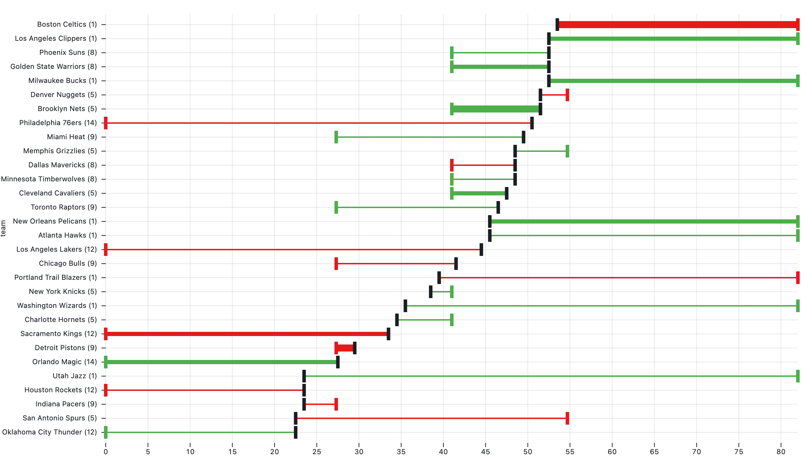

# Using github actions + Flat Data to scrape NBA data

I am in a over/under nba lines league. You basically pick which nba teams are going to over perform or underperform of what they are supposed to do. I wanted to scrape live data to figure out if I was doing well. [Check out the observable notebook which uses this data here.](https://observablehq.com/@cahaber/nba-over-under-updated-daily)

## Thanks

Thanks you to the github next team and the great resources provided.

[Github Flat Data](https://next.github.com/projects/flat-data)
